# Certificate Deployment Manager (CDM): Requirements Specification

Version 0.1 (draft for review) | 2026-09-21 | Diagrams are in the [diagrams](diagrams/) folder; a Word version of this document sits next to this file.

## Contents

- [Summary at a glance](#summary-at-a-glance)
- [1. Introduction](#1-introduction)
- [2. Analysis of the POC folder](#2-analysis-of-the-poc-folder)
- [3. Product overview](#3-product-overview)
- [4. Architecture](#4-architecture)
- [5. Functional requirements](#5-functional-requirements)
- [6. Platform adapter specifications](#6-platform-adapter-specifications)
- [7. Non-functional requirements](#7-non-functional-requirements)
- [8. Data model and lifecycle states](#8-data-model-and-lifecycle-states)
- [9. External interfaces](#9-external-interfaces)
- [10. Security and threat model](#10-security-and-threat-model)
- [11. From POC to production](#11-from-poc-to-production)
- [12. Test and acceptance strategy](#12-test-and-acceptance-strategy)
- [13. Risks and dependencies](#13-risks-and-dependencies)
- [14. Decisions and open questions](#14-decisions-and-open-questions)
- [Appendix A: Adapter contract (draft)](#appendix-a-adapter-contract-draft)
- [Appendix B: Example policy (draft)](#appendix-b-example-policy-draft)
- [Appendix C: Sectigo Certificate Manager API (indicative)](#appendix-c-sectigo-certificate-manager-api-indicative)
- [Appendix D: Source traceability](#appendix-d-source-traceability)

## Summary at a glance

The Certificate Deployment Manager (CDM) is a ServiceNow-based platform that keeps every certificate valid, correctly deployed and verified on any technology: Windows, Linux, macOS and iOS (through MDM), Kubernetes, Java, load balancers, cloud services and more. Sectigo is the first certificate authority; MID Servers in each network zone do the work; a vault holds every credential; and private keys stay on the systems that use them.

How it works:

1. A certificate is discovered or requested (or a renewal is triggered automatically before expiry).
2. Policy checks and approvals run. Nothing goes to the CA before that.
3. The private key and CSR are created on the target. Only the CSR travels.
4. The CA (Sectigo first) issues the certificate. CDM validates it against the CSR and policy.
5. The router picks one signed adapter from the target's technology and zone. A MID Server in that zone runs it with a just-in-time credential from the vault.
6. Pre-check, backup, install, activate, then verify the live endpoint (SAN, chain, expiry, thumbprint). On any failure, roll back automatically.
7. Inventory, audit trail and notifications are updated. Systems that cannot be automated safely get a manual task, and are still verified automatically.

What the review of your POC folder found (details in chapter 2): the POC proves the routing idea well, and the screenshots give nine solid security and safety principles that are now requirements. Eight gaps (G1 to G8) should be fixed before the POC is treated as proof of the design, the most important being: the mock CA returns a fake, non-PEM string; no CSR or private key is handled; WinRM runs over HTTP with Basic authentication; one admin password does everything; and script text is pasted into the flow.

Diagrams (also delivered as separate PNG files in the diagrams folder):

| Figure | Diagram | File |
|---|---|---|
| 1 | Current POC topology on the single Windows laptop, with findings G1 to G8 | Fig01_poc_current_topology.png |
| 2 | CDM system context: people, ServiceNow, CAs, vault, MID Servers and deployment targets | Fig02_system_context.png |
| 3 | Logical architecture: layers and components | Fig03_logical_architecture.png |
| 4 | Security architecture and network zones | Fig04_security_network_zones.png |
| 5 | Certificate lifecycle state machine | Fig05_certificate_lifecycle.png |
| 6 | End-to-end deployment workflow with pre-check, rollback and manual fallback | Fig06_deployment_workflow.png |
| 7 | Sequence: issue a certificate and deploy it | Fig07_sequence_issue_deploy.png |
| 8 | Technology adapter routing matrix | Fig08_adapter_routing_matrix.png |
| 9 | Platform-specific deployment paths | Fig09_platform_deployment_paths.png |
| 10 | Logical data model | Fig10_data_model.png |
| 11 | Delivery roadmap | Fig11_roadmap.png |

Requirement counts:

| Type | Count | Detail |
|---|---|---|
| Functional (FR) | 86 | P1 MVP: 55, P2: 25, P3: 6.  Must: 55, Should: 26, Could: 5. |
| Platform adapter (AD) | 66 | Windows, Linux, Apple, Kubernetes, Java, load balancers, cloud, databases and network. |
| Non-functional (NFR) | 18 | Security, availability, performance, audit, operations, usability, portability, crypto-agility. |
| Decisions and questions | 15 | Chapter 14, each with a default. |

> **Note:** Please review chapter 14 first: fifteen questions with defaults. The most important are Q1 (ServiceNow licences and plugins), Q2 (Sectigo tenant), Q3 (vault) and Q4 (what "iOS" means).

## 1. Introduction

### 1.1 Purpose

This document specifies the requirements for the Certificate Deployment Manager (CDM): a secure, generic platform that requests, issues, deploys, verifies, renews and retires digital certificates across heterogeneous technology estates (Windows, Linux, macOS and iOS, Kubernetes, Java, load balancers, cloud services and more) using ServiceNow as the orchestration layer, Sectigo as the first certificate authority (CA), and MID Servers as the network-local execution layer.

It is based on a deep analysis of everything in the POC folder (see chapter 2). It is written so that you can review it, challenge it and fix it before implementation starts. Every requirement has an ID, a priority, a delivery phase and a source, so decisions can be traced. Chapter 14 lists the decisions and open questions that need your answer.

### 1.2 Scope

In scope:

- Certificate inventory, request, approval, issuance (through pluggable CAs), deployment, verification, renewal, revocation and retirement.
- Deployment adapters for Windows, Linux/Unix, macOS/iOS/iPadOS (via MDM), Kubernetes/OpenShift, Java keystores, load balancers and firewalls, cloud services, databases, and network devices.
- Secure handling of credentials and private keys: vault-integrated credentials, no permanent private keys on MID Servers, network zoning, signed adapters.
- Pre-check, backup, rollback, post-deployment verification and cluster-aware deployment.
- A manual-fallback path for systems that cannot safely be automated.
- Audit, reporting, notifications, administration and the POC-to-production roadmap.

Out of scope (unless you decide otherwise in chapter 14):

- Operating a certificate authority (CDM consumes CAs; it does not become one).
- Code-signing, document-signing and SSH host/user certificate issuance workflows (the design does not prevent them later).
- DNS and load-balancer management beyond what a certificate binding requires.
- A general-purpose privileged access management (PAM) or endpoint-management product.

### 1.3 Audience and how to read this document

Written for the project owner and the technical reviewers (ServiceNow, PKI/security, infrastructure and platform teams) who will confirm the requirements before implementation.

- Every functional requirement uses the ID pattern FR-<area>-<nnn>; adapter requirements use AD-<platform>-<nn>; non-functional requirements use NFR-<area>-<nn>.
- Priority (Pri): M = Must, S = Should, C = Could. Phase: P1 = MVP, P2 = platform expansion, P3 = enterprise hardening (see Figure 11). P0 is the existing POC.
- Source (Src): PLAN = Promp.md.txt; SETUP = POC_SETUP_STATUS.md; MOCK = mock_sectigo.ps1; D1, D2, D3 = data1.jpeg, data2.jpeg, data3.jpeg; NEW = added by this analysis to cover your request for all technologies or from industry practice.

### 1.4 Definitions

| Term | Meaning |
|---|---|
| CA | Certificate authority that issues certificates (Sectigo first; ACME CAs, Microsoft ADCS and private CAs later). |
| CSR | Certificate signing request: contains the public key and names; the private key is never in it. |
| MID Server | ServiceNow agent (Java) inside a customer network that executes jobs locally and talks to the instance through outbound HTTPS only (ECC queue). |
| ECC queue | External Communication Channel queue: how ServiceNow and a MID Server exchange jobs and results. |
| Adapter | A signed, versioned, technology-specific deployment component (for example Windows, Linux, Kubernetes) behind a common contract. |
| Binding | The link between a certificate and the place it is used: target, service, port, store path or secret name. |
| Zone | A network segment (DMZ, internal, cloud) served by its own MID Server set. |
| JIT credential | Credential fetched from the vault just in time, short-lived and automatically revoked. |
| DCV | Domain control validation performed by the CA before it issues a public TLS certificate. |
| MDM | Mobile device management (Intune, Jamf and so on); the only supported way to deliver certificates to iOS and iPadOS devices. |
| VIP | Virtual IP address presented by a load balancer or cluster in front of several nodes. |
| SAN | Subject Alternative Name: the DNS names or IPs a certificate is valid for. |
| PDI | ServiceNow Personal Developer Instance used for the POC. |

## 2. Analysis of the POC folder

### 2.1 What was found

The folder C:\Users\riyaa\Downloads\POC contains six items. All were read; the three images were read visually.

| File | What it contains | How it is used here |
|---|---|---|
| Promp.md.txt | The original POC plan: a single Windows laptop simulates two environments (Windows certificate store and a mock Linux folder). ServiceNow PDI, MID Server, WinRM, a Sectigo REST Message, and a Flow Designer flow with an If / Else If fork on a flow variable (Windows or RHEL). Includes the Windows and Linux-simulator PowerShell scripts and the prerequisites (Java 17, WinRM, folders, MID download). | Source of the functional baseline and the POC scope (PLAN). |
| POC_SETUP_STATUS.md | Result of the local setup run on 2026-07-27: Java 17 installed, WinRM on 5985 with Basic and AllowUnencrypted enabled, network profile set to Private, folders created, URL ACL for http://+:8080/sectigo/. Manual steps left: create the PDI, download the MID Server, supply the Windows password. | Current environment state and POC-only shortcuts to remove (SETUP). |
| mock_sectigo.ps1 | A PowerShell HttpListener on http://localhost:8080/sectigo/ that answers every request with a fixed, fake certificate string. | Basis for the test-CA requirement and finding G1 (MOCK). |
| data1.jpeg | Screenshot of AI-assistant guidance: discovery versus deployment; MID Servers give network-local execution but not automatic access to every server; endpoint discovery needs no login while host-level discovery needs credentials; deployment is a separate, higher-privilege function; strongest design is ServiceNow/Sectigo orchestration plus vault-controlled credentials, zone-specific MID Servers and separate adapters for IIS, Linux, Java, F5, Kubernetes and others. The last bullet is cut off at the bottom of the screenshot and starts "For systems that cannot safely support automated deployment, the same workflow should create and ...". | Architecture principles (D1). The cut-off text is treated as "create and assign a manual task"; see question Q13. |
| data2.jpeg | Screenshot, principles 1 to 5 (and the start of 6): discovery and deployment separation; no permanent private keys on the MID Server; vault-integrated credentials; network segmentation; high availability. | Security principles (D2). |
| data3.jpeg | Screenshot, principles 6 to 9: technology allow-listing; pre-check and rollback; post-deployment verification; cluster awareness. | Safety principles (D3). The screenshot ends at item 9; more items may follow (Q13). |

> **Note:** The screenshots are guidance from an AI assistant, not a standard. Each principle was checked against common PKI and ServiceNow practice before it became a requirement.

### 2.2 What the POC does today

The POC proves one idea: one flow, fetch a certificate from a CA-like API through the MID Server, then route by a technology value to a technology-specific script. The Windows branch writes the payload to C:\temp\cert_stage and runs Import-Certificate into Cert:\LocalMachine\My. The RHEL branch writes app_server.crt into a mock folder. See Figure 1.

### 2.3 Design principles taken from the screenshots

Nine principles come from data2.jpeg and data3.jpeg, plus the discovery, credential and manual-fallback ideas from data1.jpeg. The table shows where each one lands in this specification.

| # | Principle (source) | Where it is specified |
|---|---|---|
| 1 | Discovery and deployment separation: different credentials, roles and workflow permissions (D1, D2) | FR-INV-006, FR-ADM-001, NFR-SEC-04, Figure 4 |
| 2 | No permanent private keys on the MID Server; encrypted temporary storage only where unavoidable, then secure clean-up (D2) | FR-KEY-001 to FR-KEY-003, FR-SAF-008, NFR-SEC-05 |
| 3 | Vault-integrated credentials; nothing embedded in scripts, workflow variables or config files (D2) | FR-CA-003, NFR-SEC-01, NFR-SEC-04 |
| 4 | Network segmentation: MID Servers per zone, not one server opened to the whole estate (D2) | FR-ORC-004, NFR-SEC-02, Figure 4 |
| 5 | High availability: more than one MID Server where deployment is critical (D2) | NFR-AVL-01, NFR-AVL-02, FR-ADM-006 |
| 6 | Technology allow-listing: only approved, signed, version-controlled scripts and adapters run (D3) | FR-ADP-002 to FR-ADP-005, NFR-SEC-03 |
| 7 | Pre-check and rollback: capture the current certificate and configuration before replacement (D3) | FR-SAF-001 to FR-SAF-003 |
| 8 | Post-deployment verification: SAN, chain, expiry and thumbprint at the live endpoint (D3) | FR-SAF-004, FR-SAF-005 |
| 9 | Cluster awareness: node by node, remove from rotation, validate each node and the VIP (D3) | FR-SAF-006, FR-SAF-007, FR-ORC-009 |
| 10 | Endpoint discovery needs no login; host-level discovery needs credentials (D1) | FR-INV-004, FR-INV-005 |
| 11 | Separate adapters for IIS, Linux, Java, F5, Kubernetes and other platforms (D1) | FR-ADP-006, chapter 6 |
| 12 | Manual task when a system cannot safely support automated deployment (D1, inferred) | FR-NTF-003, FR-NTF-004 |

### 2.4 Findings in the current POC

These are gaps between the POC as built and a production-grade design. They are not criticisms: several are deliberate POC shortcuts. Each one is resolved by a requirement, and the POC should be adjusted so it proves the right things (chapter 11).

| ID | Finding | Why it matters | Resolved by |
|---|---|---|---|
| G1 | mock_sectigo.ps1 returns a fixed string with literal backslash-n text and fake data, for any request path and method. | It is not a valid PEM certificate, so Import-Certificate on the Windows branch is expected to fail. The POC cannot prove a real import until the mock issues a genuine test certificate. | FR-CA-010 |
| G2 | The flow only moves a public certificate. No CSR, no private key handling. | A certificate imported without its private key cannot serve TLS on Windows. The real lifecycle needs key generation and CSR first. | FR-KEY-001, AD-WIN-04, AD-WIN-05 |
| G3 | WinRM over HTTP 5985 with Basic authentication and AllowUnencrypted set to true; network profile changed to Private. | Acceptable for loopback in a POC only. In production, credentials and certificate material must never cross unencrypted transport. | AD-WIN-02, NFR-SEC-01 |
| G4 | One Windows administrator account, with its password stored in a ServiceNow credential, is used for everything. | Violates discovery/deployment separation and least privilege. Passwords should be vault-held and short-lived. | FR-INV-006, FR-ADM-001, NFR-SEC-04 |
| G5 | The REST response body is pasted into a PowerShell here-string in the flow step, and the script text is edited in the flow. | Script injection risk and no allow-list, version control or signing. Data must be passed as validated parameters to approved adapters. | FR-ADP-002 to FR-ADP-005 |
| G6 | The REST Message endpoint is a placeholder (https://sectigo.com) while the mock listens on http://localhost:8080/sectigo/. No authentication, certificate types or profiles are modelled. | The CA connector must be configurable per environment (sandbox versus production) with vault-held credentials. | FR-CA-002 to FR-CA-004 |
| G7 | The target technology is a hand-edited flow variable (Windows or RHEL). | Routing must come from the target's CMDB record (technology, zone, environment), not from a manual switch. | FR-ORC-003 |
| G8 | The Linux simulation is a bare file write. | No permissions, ownership, service reload, backup, rollback or verification, so it proves routing but not deployment safety. | AD-LNX-05 to AD-LNX-12, FR-SAF |

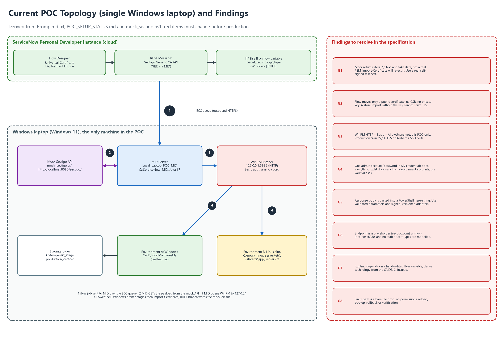

*Figure 1: Current POC topology on the single Windows laptop, with findings G1 to G8*

## 3. Product overview

### 3.1 Vision and goals

One governed, auditable way to keep every certificate in the organisation valid, correctly deployed and verified, on any platform, with no expired-certificate outages and no private keys left lying around.

| Goal | Measure of success |
|---|---|
| No expiry outages | Zero production incidents caused by expired managed certificates; renewal starts at least 30 days before expiry by default. |
| Generic, multi-technology | The same request-to-verified-deployment flow works through adapters for Windows, Linux, Apple (MDM), Kubernetes, Java, load balancers, cloud and more. |
| Secure by design | No permanent private keys on MID Servers, no secrets in scripts or variables, only signed adapters run, every action audited. |
| Safe change | Every deployment has pre-checks, a rollback point, live verification and automatic rollback on failure. |
| Visible | A live inventory and dashboard: what exists, who owns it, where it is bound, when it expires. |
| Shorter certificate lifetimes ready | Automation copes with 200-day certificates today and 47-day certificates by 2029 (CA/B Forum ballot SC-081; confirm current dates). |

### 3.2 System context

Figure 2 shows CDM and everything around it. ServiceNow holds the application, inventory, workflow, approvals and audit. CAs issue certificates. A vault holds credentials and, where needed, key material. MID Servers, one set per network zone, execute adapters against the targets.

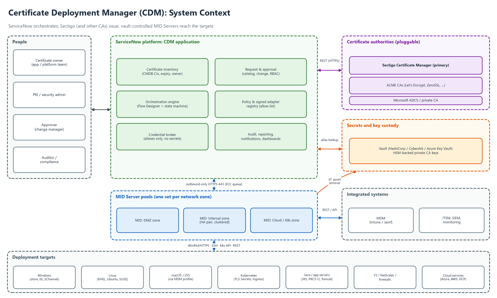

*Figure 2: CDM system context: people, ServiceNow, CAs, vault, MID Servers and deployment targets*

### 3.3 Users and roles

| Role | Who | Main capabilities |
|---|---|---|
| Certificate requester / owner | Application or platform team | Request, renew and view own certificates; complete manual tasks; see deployment status. |
| Approver | Change manager, application owner | Approve or reject requests according to policy; cannot approve own request. |
| PKI / security admin | Security or PKI team | Manage CA profiles, policies, adapters, exceptions; revoke; investigate incidents. |
| Deployment operator | Platform / operations team | Monitor jobs, retry, roll back, manage windows and zones. |
| Discovery operator | Operations or security | Run discovery with read-only credentials; review unmanaged certificates. |
| Adapter publisher | Engineering | Propose, test and sign adapter versions; cannot approve own release. |
| Auditor | Compliance | Read-only access to inventory, audit trail and reports. |
| Platform administrator | ServiceNow admin | Maintain the instance, MID Servers, integrations and access. |

### 3.4 Assumptions and constraints

- ServiceNow is the orchestration platform, as in the POC plan. The production licence and plugins (Discovery, Integration Hub, Orchestration) are not yet confirmed (Q1).
- Sectigo Certificate Manager is the first CA. A sandbox tenant with API access is needed for Phase 1 (Q2).
- "iOS" in the request is read as Apple platforms (iOS, iPadOS, macOS) delivered through MDM. If Cisco IOS network devices were meant, they are covered in Phase 3 (Q4).
- Publicly trusted TLS certificate lifetimes are shrinking; the design must treat renewal as routine and frequent.
- The POC runs on one Windows laptop; production needs MID Servers per zone, a vault and non-loopback targets.

### 3.5 Key design decisions

| # | Decision | Rationale |
|---|---|---|
| DD-1 | Private keys are generated on the target (or HSM/KMS/TPM) whenever the platform allows. Only the CSR and the public certificate travel. | Removes the largest risk (key sprawl) and follows principle 2. Where a platform cannot generate a CSR, an encrypted, short-lived PKCS#12 path is the exception (FR-KEY-003). |
| DD-2 | Platform logic lives only in signed adapters behind one contract. The orchestrator knows nothing about IIS, nginx or Kubernetes. | Makes the product generic and lets new technologies be added without touching the core flow. |
| DD-3 | Technology and zone routing come from the CMDB target record. | Removes hand-edited variables (G7) and lets renewals run unattended. |
| DD-4 | CAs are connectors behind one interface. | Sectigo first; ACME, ADCS and others later without redesign. |
| DD-5 | Verification is against the live endpoint, and failure triggers rollback by default. | A successful copy is not a successful deployment (principle 8). |
| DD-6 | Anything without a safe adapter goes to a manual task, and verification is still automated. | Full coverage of the estate without unsafe automation (D1). |
| DD-7 | Discovery and deployment are separate functions with separate credentials and workflows. | Principle 1; discovery is read-only and lower risk. |

## 4. Architecture

### 4.1 Logical architecture

Figure 3 shows five layers. Each layer only talks to the one below it, and all platform-specific behaviour is confined to the adapter layer.

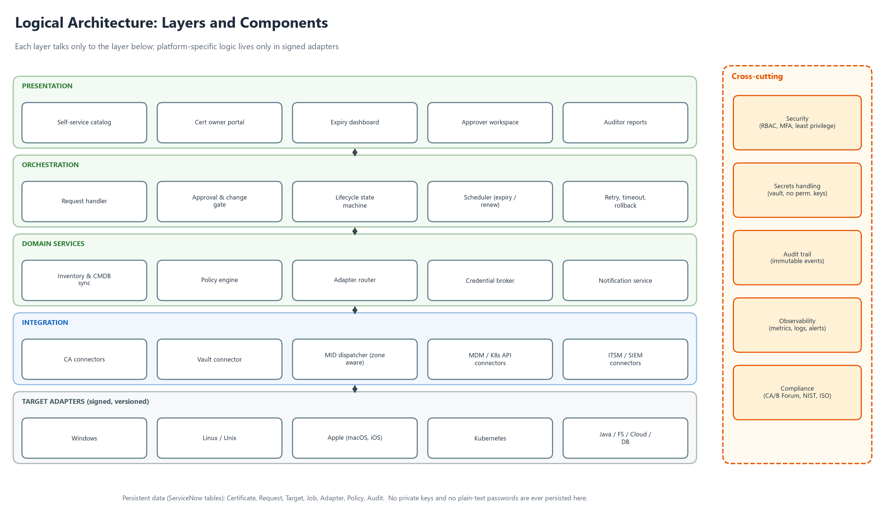

*Figure 3: Logical architecture: layers and components*

### 4.2 Deployment architecture and security zones

Figure 4 shows the production shape. ServiceNow never connects into the customer network: MID Servers open outbound HTTPS 443 connections and pick up jobs. Each network zone has its own MID Servers (a high-availability pair where deployment is critical) and its own discovery and deployment accounts. Credentials come from the vault just in time.

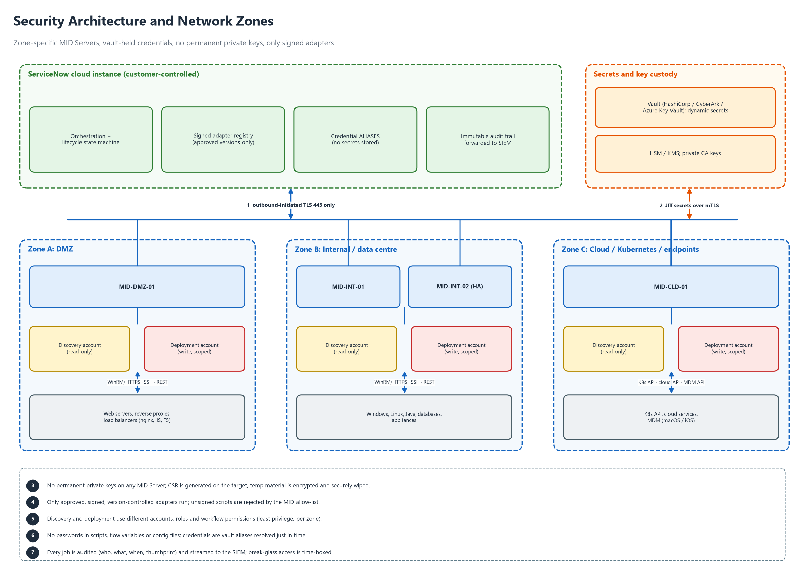

*Figure 4: Security architecture and network zones*

### 4.3 Components

| Component | Responsibility | Runs on |
|---|---|---|
| Request and approval | Catalog, validation against policy, approvals, change link. | ServiceNow |
| Inventory | Certificate, Binding and Target records; expiry calculation; CMDB relationships. | ServiceNow |
| Orchestrator | State machine and workflow; retries, timeouts, concurrency and scheduling. | ServiceNow (Flow Designer and scripted actions) |
| Policy engine | Key size, algorithms, validity, allowed CAs and domains, approval rules, windows. | ServiceNow |
| Adapter registry and router | Approved, signed adapter versions; chooses the adapter from technology, zone and capability. | ServiceNow |
| Credential broker | Resolves credential aliases into JIT secrets; never stores secrets. | ServiceNow plus vault connector |
| CA connectors | Enroll, collect, renew, revoke, status per CA. | ServiceNow (REST) or MID Server |
| MID dispatcher | Zone-aware job dispatch, health and failover. | ServiceNow and MID Servers |
| Adapters | Technology-specific pre-check, CSR, install, activate, verify, rollback, discovery. | MID Server (signed) |
| Notification and manual tasks | Owner notifications, manual fallback tasks, incidents. | ServiceNow |
| Audit and reporting | Tamper-evident audit trail, dashboards, SIEM export. | ServiceNow plus SIEM |
| Vault | Dynamic secrets, key custody, HSM or KMS. | HashiCorp Vault, CyberArk or Azure Key Vault (Q3) |

### 4.4 Technology baseline

- Platform: ServiceNow (scoped application), Flow Designer, scripted REST, MID Server on Java 17 or the version required by the instance release.
- Adapters: PowerShell 5.1/7 (Windows), POSIX shell plus OpenSSL (Linux), kubectl or the Kubernetes API (Kubernetes), keytool (Java), vendor REST APIs (load balancers), MDM REST APIs (Apple).
- CAs: Sectigo Certificate Manager REST API first; ACME (RFC 8555) and Microsoft ADCS later.
- Transport: WinRM over HTTPS or Kerberos, SSH with certificates, Kubernetes API over TLS, REST over TLS 1.2 or higher.
- Source control and CI for adapters, with signing of releases.

## 5. Functional requirements

Requirements are grouped by area. The certificate lifecycle they implement is in Figure 5, the end-to-end workflow in Figure 6, and the message flow in Figure 7.

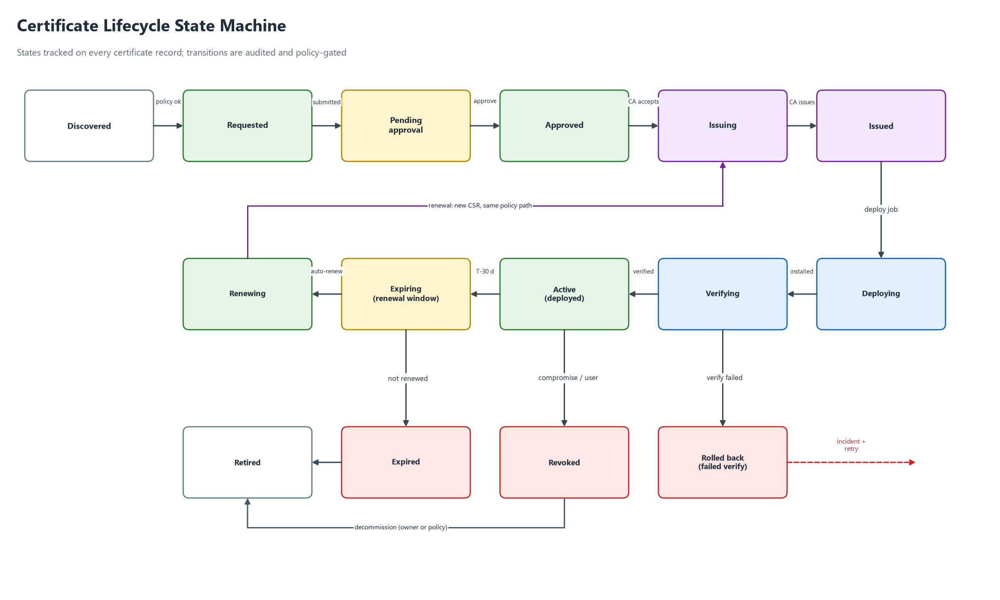

*Figure 5: Certificate lifecycle state machine*

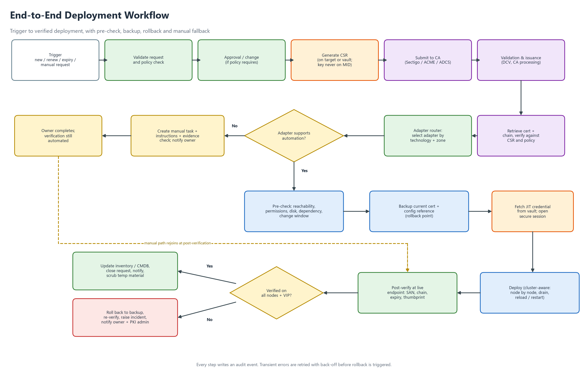

*Figure 6: End-to-end deployment workflow with pre-check, rollback and manual fallback*

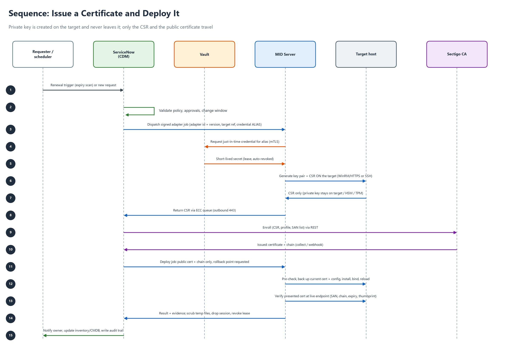

*Figure 7: Sequence: issue a certificate and deploy it*

### 5.1 Inventory and discovery (INV)

| ID | Requirement | Pri | Phase | Src |
|---|---|---|---|---|
| FR-INV-001 | Maintain a central inventory of certificates: common name, SANs, serial, SHA-256 thumbprint, issuer, validity dates, key algorithm and size, owner group, environment, state. | M | P1 | NEW, D1 |
| FR-INV-002 | Link each certificate to one or more Bindings (target, service, port, store path or secret name) so the renewal target is known without human input. | M | P1 | NEW |
| FR-INV-003 | Seed the inventory by manual entry, CSV import and REST API. | M | P1 | NEW |
| FR-INV-004 | Endpoint discovery: TLS scan of host and port ranges from a MID Server, recording the presented chain. Requires no server login. | S | P2 | D1 |
| FR-INV-005 | Host-level discovery: read certificate stores, keystores and paths through adapters using dedicated read-only credentials. | S | P2 | D1, D2 |
| FR-INV-006 | Discovery and deployment shall use different credentials, roles and workflow permissions. No account holds both. | M | P1 | D1, D2 |
| FR-INV-007 | Reconcile with the CA inventory (Sectigo) to find certificates issued outside CDM. | S | P2 | NEW |
| FR-INV-008 | Compute days to expiry and raise flags at configurable thresholds (default 90, 60, 30, 14, 7, 1 days). | M | P1 | NEW |
| FR-INV-009 | Report weak or non-compliant certificates: SHA-1, RSA below 2048, self-signed, wildcard misuse, no owner. | C | P3 | NEW |
| FR-INV-010 | Represent targets as CMDB configuration items with technology, environment, zone, cluster and owner attributes. | S | P2 | NEW |

### 5.2 Request and approval (REQ)

| ID | Requirement | Pri | Phase | Src |
|---|---|---|---|---|
| FR-REQ-001 | Provide a catalog request: common name, SANs, targets, owner, environment, validity, CA profile, justification. | M | P1 | NEW |
| FR-REQ-002 | Validate every request against policy before any CA call: allowed domains, key algorithm and size, maximum validity, allowed CA, wildcard rules. | M | P1 | NEW |
| FR-REQ-003 | Configurable approval per policy: auto-approve low risk; manager or PKI admin approval for wildcard or production. Requester cannot approve their own request. | M | P1 | NEW |
| FR-REQ-004 | Integrate with change management: production deployments require an approved change and are scheduled in its window. | S | P2 | NEW |
| FR-REQ-005 | Create renewal requests automatically at a configurable threshold (default 30 days before expiry) and run them through the same policy path. | M | P1 | NEW |
| FR-REQ-006 | Revocation request with mandatory reason and approval; calls the CA and updates inventory and bindings. | S | P2 | NEW |
| FR-REQ-007 | Each request has a unique ID and a visible state history. | M | P1 | NEW |
| FR-REQ-008 | Bulk requests from CSV with per-item status. | S | P2 | NEW |
| FR-REQ-009 | Emergency replacement path with post-hoc approval and elevated audit. | C | P3 | NEW |

### 5.3 CA integration (CA)

| ID | Requirement | Pri | Phase | Src |
|---|---|---|---|---|
| FR-CA-001 | Define a CA connector interface (enroll, collect, renew, revoke, status, list profiles) so CAs are pluggable. | M | P1 | NEW, D1 |
| FR-CA-002 | Implement the Sectigo connector on the Sectigo Certificate Manager REST API: enroll with CSR, collect the certificate and chain in PEM, renew, revoke. Endpoints and fields per current Sectigo documentation (Appendix C). | M | P1 | PLAN |
| FR-CA-003 | CA credentials (login, password or API key, customer URI) are stored only as vault aliases, never in a REST Message, script or flow variable. | M | P1 | D2 |
| FR-CA-004 | CA profiles carry an environment (sandbox or production). A sandbox certificate can never be deployed to a production target. | M | P1 | SETUP, NEW |
| FR-CA-005 | ACME connector (RFC 8555) with HTTP-01 and DNS-01 challenge support for eligible domains. | S | P2 | NEW |
| FR-CA-006 | Microsoft ADCS and private CA connector. | S | P3 | NEW |
| FR-CA-007 | Handle asynchronous issuance: pending validation, polling with back-off, optional webhook, timeout and escalation. | M | P1 | NEW |
| FR-CA-008 | Validate every returned certificate: public key matches the CSR, names match the request, chain builds to a trusted root, validity is correct. Reject otherwise. | M | P1 | NEW |
| FR-CA-009 | Respect CA rate limits and quotas by queuing and throttling. | S | P2 | NEW |
| FR-CA-010 | Provide a test CA (replacing the fixed-string mock) that signs real CSRs and returns real PEM with correct content types. It must be impossible to enable in production. | M | P1 | MOCK |

### 5.4 Key and CSR management (KEY)

| ID | Requirement | Pri | Phase | Src |
|---|---|---|---|---|
| FR-KEY-001 | Generate private keys on the target (or in HSM, TPM or KMS) whenever the platform supports it. Only the CSR travels. | M | P1 | D2 |
| FR-KEY-002 | No permanent private key is stored on a MID Server, in ServiceNow tables, logs, ECC payloads or flow variables. | M | P1 | D2 |
| FR-KEY-003 | Where key transport is unavoidable, use a password-protected PKCS#12 with a one-time password from the vault, in encrypted temporary storage, with a short lifetime (default 15 minutes), then secure deletion. Deletion is verified and audited. | M | P1 | D2 |
| FR-KEY-004 | Key policy: RSA 3072 default (2048 minimum), ECDSA P-256 or P-384 where supported; non-exportable where the platform allows. | M | P1 | NEW |
| FR-KEY-005 | Support HSM or KMS-backed keys (PKCS#11, Azure Key Vault HSM, AWS CloudHSM) for critical services. | S | P2 | NEW |
| FR-KEY-006 | Generate a new key pair on every renewal by default; key reuse needs an approved policy exception. | M | P1 | NEW |
| FR-KEY-007 | Detect and report weak key parameters during discovery. | S | P2 | NEW |
| FR-KEY-008 | Check each CSR against policy (names, algorithm, size) before submission to the CA. | M | P1 | NEW |

### 5.5 Orchestration and lifecycle (ORC)

| ID | Requirement | Pri | Phase | Src |
|---|---|---|---|---|
| FR-ORC-001 | Implement the lifecycle state machine (Figure 5). Transitions are enforced server-side. Illegal transitions are rejected and audited. | M | P1 | NEW |
| FR-ORC-002 | Execute each request as the workflow in Figure 6. Steps are idempotent and resumable after MID or instance restarts. | M | P1 | PLAN, NEW |
| FR-ORC-003 | Derive technology, zone and environment from the target's CMDB record, not from a manually edited variable. | M | P1 | PLAN (G7) |
| FR-ORC-004 | Dispatch jobs only to MID Servers that belong to the target's zone. | M | P1 | D2 |
| FR-ORC-005 | Timeouts and retries with exponential back-off for transient errors. Permanent failure triggers rollback and an incident. | M | P1 | NEW |
| FR-ORC-006 | Concurrency limits per zone, adapter and cluster (default 5) and a per-target lock so jobs never overlap. | S | P2 | NEW |
| FR-ORC-007 | Schedule deployments in change windows, with deferral and re-queue. | S | P2 | NEW |
| FR-ORC-008 | Dry-run mode that performs pre-checks only and reports what would change. | M | P1 | NEW |
| FR-ORC-009 | Staged rollout for multi-target deployments: canary first, then waves, stop on first failure. | S | P2 | D3 |
| FR-ORC-010 | Authorised cancellation before deployment starts. After start, only a safe abort with rollback. | M | P1 | NEW |

### 5.6 Adapter framework and routing (ADP)

| ID | Requirement | Pri | Phase | Src |
|---|---|---|---|---|
| FR-ADP-001 | Define one adapter contract with operations: precheck, backup, generate_csr, install, activate, verify, rollback, cleanup, discover. Each returns structured JSON (status, evidence, error code). See Appendix A. | M | P1 | D1, NEW |
| FR-ADP-002 | Keep an adapter registry with technology, version, SHA-256 signature and approval status. Only approved, signed versions may run (allow-list). | M | P1 | D3 |
| FR-ADP-003 | MID Servers run only registered adapters. Free-text script execution from flow variables is disabled. | M | P1 | D3 (G5) |
| FR-ADP-004 | Adapter inputs are typed and validated and passed as parameters, never concatenated into script text. Certificate content is validated as PEM before use. | M | P1 | NEW (G5) |
| FR-ADP-005 | Adapters are version controlled with peer review, automated tests and signed releases, promoted dev, test, production. | M | P1 | D3 |
| FR-ADP-006 | Deliver adapters in phases per Figure 8: Windows, Linux and Manual in P1; Kubernetes, Apple, Java, load balancers in P2; cloud, databases, network in P3. | M | P1 | D1, NEW |
| FR-ADP-007 | Adapters declare capabilities (CSR on target, cluster aware, rollback, hitless activation). The router uses them, for example to force manual fallback when rollback is impossible. | S | P2 | NEW |
| FR-ADP-008 | Provide an adapter template, linter and documentation for new technologies. | S | P2 | NEW |
| FR-ADP-009 | Map adapter errors to a catalogue of error codes with remediation hints. | M | P1 | NEW |
| FR-ADP-010 | Allow several adapters per technology, chosen by service type (for example nginx and Apache on Linux). | C | P3 | NEW |

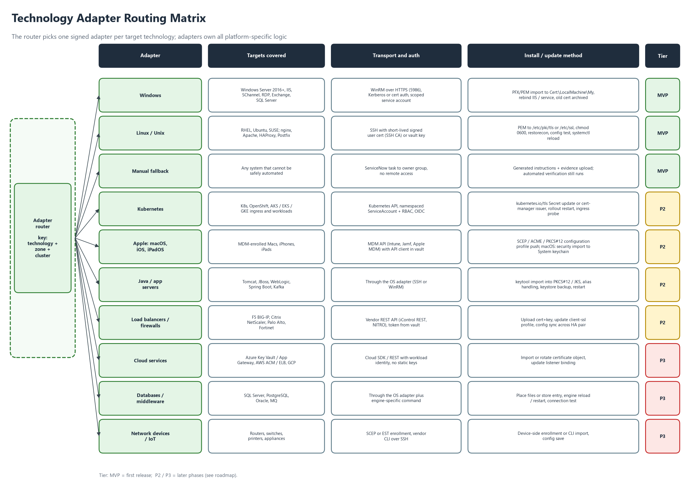

*Figure 8: Technology adapter routing matrix*

### 5.7 Deployment safety (SAF)

| ID | Requirement | Pri | Phase | Src |
|---|---|---|---|---|
| FR-SAF-001 | Pre-check before any change: target reachable, credential valid, permissions, disk space, service state, current certificate identified, cluster peers healthy, change window open. | M | P1 | D3 |
| FR-SAF-002 | Back up the current certificate and configuration reference (thumbprint, binding, config version) as a rollback point before replacing anything. Keys stay in place; nothing secret is copied into ServiceNow. | M | P1 | D3 |
| FR-SAF-003 | Roll back automatically when activation or verification fails. The rollback itself is verified. | M | P1 | D3 |
| FR-SAF-004 | Verify against the live endpoint: presented thumbprint equals expected, SAN covers all names, chain is complete and trusted, not expired, protocol and cipher unchanged. Run from a MID Server in the target's zone. | M | P1 | D3 |
| FR-SAF-005 | A failed verification is never ignored. It requires rollback or an approved, audited exception. | M | P1 | D3 |
| FR-SAF-006 | Cluster awareness: deploy node by node, drain or remove from rotation, restart, health-check, re-add. Validate each node and the VIP. Abort and roll back on the first failure. | S | P2 | D3 |
| FR-SAF-007 | Confirm high-availability pair synchronisation after deployment (for example F5 device group, Windows failover cluster, Kubernetes replicas). | S | P2 | D3 |
| FR-SAF-008 | Secure clean-up: staging files, temporary key material and sessions are removed and confirmed. Evidence is audited. | M | P1 | D2 |
| FR-SAF-009 | Adapters declare whether activation is hitless (reload) or needs a restart. Policy can require a change window for restarts. | S | P2 | NEW |
| FR-SAF-010 | Refuse to deploy when the certificate names do not match the binding's expected names. | M | P1 | NEW |

### 5.8 Notifications and manual fallback (NTF)

| ID | Requirement | Pri | Phase | Src |
|---|---|---|---|---|
| FR-NTF-001 | Notify owner groups and PKI admins on expiry thresholds, request status, approvals needed, deployment success or failure, and rollback. | M | P1 | NEW |
| FR-NTF-002 | Channels: email (M); Teams or Slack and ServiceNow mobile (S); paging for critical services (C). | M | P1 | NEW |
| FR-NTF-003 | Manual fallback: when a technology has no approved adapter, policy forbids automation, or a prerequisite fails, create a task for the owner group with generated step-by-step instructions, the CSR if needed, the certificate package and required evidence fields. | M | P1 | D1 |
| FR-NTF-004 | Manual tasks have SLA timers and escalation. Completion triggers automated verification of the live endpoint. | M | P1 | D1 |
| FR-NTF-005 | Create an incident automatically for failed deployments or rollbacks, linked to the job evidence. | S | P2 | NEW |
| FR-NTF-006 | Notification templates are configurable and never contain secrets or key material. | S | P2 | NEW |

### 5.9 Reporting and audit (RPT)

| ID | Requirement | Pri | Phase | Src |
|---|---|---|---|---|
| FR-RPT-001 | Dashboard: certificates by state, expiring in 7, 30, 60 and 90 days, failed deployments, automation coverage, renewal lead time. | M | P1 | NEW |
| FR-RPT-002 | Tamper-evident audit trail for every action: who, what, when, target, adapter and version, job ID, result, thumbprint before and after. Exportable to a SIEM. | M | P1 | NEW |
| FR-RPT-003 | Compliance reports: inventory export, policy exceptions, orphaned or unmanaged certificates. | S | P2 | NEW |
| FR-RPT-004 | Team scorecards and automation coverage by technology. | S | P2 | NEW |
| FR-RPT-005 | Scheduled report delivery. | C | P3 | NEW |
| FR-RPT-006 | Configurable audit retention (default 13 months online, then archive per policy). | M | P1 | NEW |

### 5.10 Administration (ADM)

| ID | Requirement | Pri | Phase | Src |
|---|---|---|---|---|
| FR-ADM-001 | Role-based access with segregation of duties: requester, approver, PKI admin, deployment operator, discovery operator, adapter publisher, auditor. Least privilege. | M | P1 | D1, D2 |
| FR-ADM-002 | Configuration registry for zones, MID Servers, CA profiles, policies, adapters and thresholds. All changes versioned and audited. | M | P1 | NEW |
| FR-ADM-003 | Separate development, test and production instances with controlled promotion. | M | P1 | NEW |
| FR-ADM-004 | SSO and MFA for privileged actions, and a time-boxed break-glass procedure. | S | P2 | NEW |
| FR-ADM-005 | Adapter approval requires a second person (four-eyes). | S | P2 | D3 |
| FR-ADM-006 | Health monitoring and alerts for MID Servers (heartbeat, version, HA state), CA connectors and the vault. | M | P1 | D2 |
| FR-ADM-007 | Domain separation for business units. | C | P3 | NEW |

## 6. Platform adapter specifications

This chapter answers the requirement to cover all technologies. Each platform has its own adapter with the same contract (FR-ADP-001). The routing matrix is Figure 8, and the five-step path per platform is Figure 9. Commands and paths are indicative and must be confirmed in adapter design.

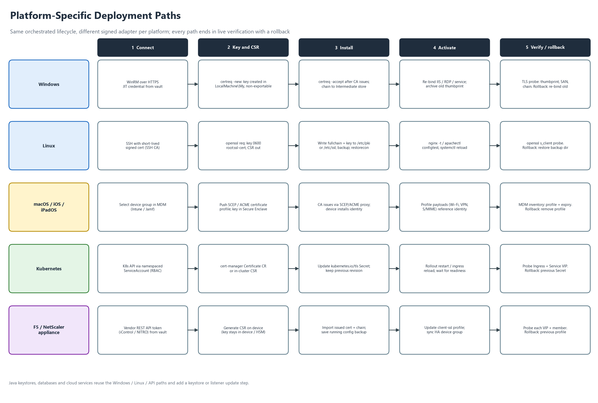

*Figure 9: Platform-specific deployment paths*

### 6.1 Windows (adapter WIN, Phase 1)

| ID | Aspect | Specification |
|---|---|---|
| AD-WIN-01 | Scope | Windows Server 2016, 2019, 2022 and 2025. Certificate store, IIS, RDP listener, WinRM HTTPS listener, SQL Server, Windows services bound with netsh http. Exchange and ADFS in Phase 3. |
| AD-WIN-02 | Transport | WinRM over HTTPS (5986) with a certificate-authenticated listener, or Kerberos in a domain. HTTP, Basic and AllowUnencrypted are forbidden outside the POC. Prefer a constrained JEA endpoint exposing only approved cmdlets. |
| AD-WIN-03 | Accounts | Separate read-only discovery account and scoped deployment account, gMSA or vault-rotated. Never a domain administrator. |
| AD-WIN-04 | CSR and key | certreq -new with an INF: key created in Cert:\LocalMachine\My request store, non-exportable, 3072-bit, SANs from the request. Only the CSR leaves the host. |
| AD-WIN-05 | Install | certreq -accept binds the issued certificate to its private key. PFX import (Import-PfxCertificate, non-exportable) only under FR-KEY-003. Install intermediates into the intermediate CA store. Roots are managed by Group Policy, not CDM. |
| AD-WIN-06 | Activate | IIS binding update including SNI, RDP listener thumbprint, SQL Server certificate registry setting with service restart, WinRM HTTPS listener, netsh http sslcert. |
| AD-WIN-07 | Backup | Record the previous thumbprint and every binding that uses it. The old certificate stays in the store (archived) for a retention period (default 30 days). |
| AD-WIN-08 | Verify | TLS handshake with SNI to host and port from the zone MID Server. Compare thumbprint, validate the chain with the Windows chain engine, check SAN and expiry. |
| AD-WIN-09 | Rollback | Re-apply the previous thumbprint to each binding, restart if needed, verify. Remove the failed certificate. |
| AD-WIN-10 | Discovery | Enumerate Cert:\LocalMachine\My and web-hosting stores: subject, SAN, thumbprint, expiry, has-private-key flag, bindings. |
| AD-WIN-11 | POC continuity | The POC path (Import-Certificate into Cert:\LocalMachine\My) is kept as the reference and extended with the CSR, key-association and binding steps. |

### 6.2 Linux and Unix (adapter LNX, Phase 1)

| ID | Aspect | Specification |
|---|---|---|
| AD-LNX-01 | Scope | RHEL, Rocky, Alma 8 and later; Ubuntu LTS 20.04 and later; Debian 11 and later; SUSE 15; Amazon Linux 2023. Services: nginx, Apache, HAProxy, Postfix, Dovecot, generic file-based TLS. |
| AD-LNX-02 | Transport | SSH from the zone MID Server using short-lived signed SSH certificates from the vault (or a vault-brokered key). No password authentication. Host keys pinned. |
| AD-LNX-03 | Privilege | Dedicated deployment user. sudo rules limited to named commands (install, service reload, configtest, restorecon). |
| AD-LNX-04 | CSR and key | openssl req -new with a new 3072-bit key created under umask 077 in /etc/pki/tls/private (RHEL family) or /etc/ssl/private (Debian family). Only the CSR is returned. |
| AD-LNX-05 | Install | Write certificate and chain to a versioned file and switch an atomic "current" symlink. Certificate mode 0644; key 0600 or 0640 with the service group. |
| AD-LNX-06 | SELinux and AppArmor | restorecon on written paths and verification of the context; check the AppArmor profile allows the new path. |
| AD-LNX-07 | Activate | nginx -t then systemctl reload nginx; apachectl configtest then reload httpd or apache2; haproxy -c then reload. Restart only if reload is unsupported (FR-SAF-009). |
| AD-LNX-08 | Backup | Copy the previous certificate, key reference and config file to a root-only backup directory keyed by job ID. |
| AD-LNX-09 | Verify | openssl s_client with -servername from the zone MID Server. Compare fingerprint, SAN, chain and expiry. |
| AD-LNX-10 | Rollback | Flip the symlink back, reload, verify. |
| AD-LNX-11 | Trust stores | update-ca-trust or update-ca-certificates only for private CA roots and only after explicit approval. |
| AD-LNX-12 | Simulator | The mock folder (C:\mock_linux_server) is upgraded to enforce naming, simulated permissions, a reload stub and a verify stub, and a real Linux target (WSL, VM or container) is added in Phase 1 so real validation is possible. |

### 6.3 macOS, iOS and iPadOS (adapter APL, Phase 2)

| ID | Aspect | Specification |
|---|---|---|
| AD-APL-01 | Scope | MDM-enrolled iPhone, iPad and Mac. iOS and iPadOS cannot be reached by SSH or WinRM: certificates arrive only through MDM configuration profiles (or user action). macOS supports MDM and direct methods; MDM is preferred. |
| AD-APL-02 | MDM integration | Microsoft Intune and Jamf Pro first; Workspace ONE and Kandji in Phase 3. MDM API client credentials are vault aliases. Apple Business Manager enrolment is assumed. |
| AD-APL-03 | Identity certificates | Wi-Fi, VPN, client authentication and S/MIME identities use SCEP or ACME payloads. The key is generated on the device (Secure Enclave or keychain). CDM manages the profile and the CA endpoint; it never sees a private key. |
| AD-APL-04 | Trust certificates | Root and intermediate certificates are pushed with certificate payloads through MDM. |
| AD-APL-05 | macOS server certificates | For Macs running services, use the SSH path with security import into the System keychain or file paths (Phase 3). |
| AD-APL-06 | CA path | SCEP or ACME to the Sectigo endpoint (or the MDM's certificate connector). CDM orchestrates profile assignment and monitors status. |
| AD-APL-07 | Activate and verify | Assign the profile to a device group. Verify through the MDM inventory API: profile installed, certificate serial and expiry. Live TLS probing is not applicable. |
| AD-APL-08 | Rollback | Remove or replace the profile with the previous version. |
| AD-APL-09 | Constraints | Silent installation needs supervised devices; BYOD needs user approval. Offline devices produce a "pending device check-in" state with an SLA, not a failure. |
| AD-APL-10 | Discovery | Pull certificate inventory from the MDM into the CDM inventory. |
| AD-APL-11 | Android | Same pattern through Android Enterprise MDM (Phase 3, Could). |

### 6.4 Kubernetes and OpenShift (adapter K8S, Phase 2)

| ID | Aspect | Specification |
|---|---|---|
| AD-K8S-01 | Scope | Upstream Kubernetes, OpenShift 4, AKS, EKS, GKE. Ingress (ingress-nginx, Traefik), Istio or Gateway API, and workloads that mount TLS Secrets. |
| AD-K8S-02 | Access | Kubernetes API over TLS with a ServiceAccount and short-lived tokens (OIDC or workload identity). RBAC limited to named namespaces and verbs (secrets get/create/update by label; deployments get/patch for restart). No cluster-admin. A zone MID Server or an in-cluster outbound agent runs the job. |
| AD-K8S-03 | Modes | Push mode: CDM writes the kubernetes.io/tls Secret. Delegated mode: cert-manager owns issuance and renewal (ACME to Sectigo) and CDM inventories and monitors. Delegated is the recommendation for new clusters. |
| AD-K8S-04 | CSR and key | Delegated: cert-manager generates the key in-cluster. Push: a one-shot Job or ephemeral pod creates the key and CSR; the key exists only as Secret data. Encryption at rest with a KMS provider is required. |
| AD-K8S-05 | Install | Apply the Secret (tls.crt = leaf plus chain, tls.key) annotated with thumbprint and job ID. Keep the previous revision as a labelled Secret. |
| AD-K8S-06 | GitOps | If Argo CD or Flux manages the cluster, open a pull request or update the sealed secret instead of writing directly, to avoid drift. |
| AD-K8S-07 | Activate | Ingress controllers normally reload on Secret change. For pods that mount the Secret, run a rollout restart honouring PodDisruptionBudgets and readiness gates. |
| AD-K8S-08 | Verify | Probe the Ingress host with SNI from the zone. Compare thumbprint, SAN, chain and expiry. Optionally probe in-cluster mTLS endpoints. |
| AD-K8S-09 | Rollback | Restore the previous Secret revision, restart, verify. |
| AD-K8S-10 | Discovery | List kubernetes.io/tls Secrets (parse certificate only), cert-manager Certificate resources and Ingress TLS hosts across namespaces. |
| AD-K8S-11 | Multi-cluster | A cluster registry with per-cluster credentials in the vault; deployments batched per cluster. |

### 6.5 Java keystores and application servers (adapter JVA, Phase 2)

| ID | Aspect | Specification |
|---|---|---|
| AD-JVA-01 | Scope | JKS and PKCS#12 keystores and truststores for Tomcat, JBoss/WildFly, WebLogic, WebSphere Liberty, Spring Boot, Kafka and similar. |
| AD-JVA-02 | Access | Through the Windows or Linux adapter (SSH or WinRM). The keystore path and alias come from the Binding. |
| AD-JVA-03 | CSR and key | keytool -genkeypair (3072-bit) and -certreq. The keystore password comes from the vault and is never on a visible command line (use a protected file or environment). |
| AD-JVA-04 | Install | keytool -importcert of the chain in order (root, intermediates, leaf). Prefer PKCS#12; flag JKS for migration. |
| AD-JVA-05 | Backup and rollback | Timestamped, checksummed keystore copy. Rollback restores it and restarts. |
| AD-JVA-06 | Activate and verify | Connector reload or service restart per product. Verify with s_client and keytool -list -v. |

### 6.6 Load balancers and firewalls (adapter LBX, Phase 2 for F5 and NetScaler, Phase 3 for others)

| ID | Aspect | Specification |
|---|---|---|
| AD-LBX-01 | Scope | F5 BIG-IP (TMOS 14 and later) and Citrix NetScaler in Phase 2; Palo Alto, Fortinet, Cisco, A10 in Phase 3. |
| AD-LBX-02 | Access | Vendor REST API (iControl REST, NITRO) over HTTPS from the zone MID Server. Token or service account from the vault. Management-plane ACL allows only MID Server addresses. |
| AD-LBX-03 | CSR and key | Generated on the device (FIPS HSM if present); the key stays on the device. |
| AD-LBX-04 | Install | Import the certificate and chain as a new, versioned object. Never overwrite the existing one. |
| AD-LBX-05 | Activate | Update the client-SSL profile to the new object, sync the device group, save the configuration. |
| AD-LBX-06 | Verify | Probe every VIP and each TLS-enabled pool member; confirm the standby has synchronised. |
| AD-LBX-07 | Rollback | Point the profile back to the previous object and sync. |
| AD-LBX-08 | Discovery | List certificates on the device and map them to virtual servers and profiles. |

### 6.7 Cloud services (adapter CLD, Phase 3)

| ID | Aspect | Specification |
|---|---|---|
| AD-CLD-01 | Scope | Azure Key Vault with Application Gateway or Front Door; AWS ACM with ELB or CloudFront; Google Certificate Manager. |
| AD-CLD-02 | Access | Workload identity or OIDC federation. No static access keys. |
| AD-CLD-03 | Approach | Prefer native managed certificates that renew themselves and only inventory them. Use import (Key Vault certificate import, ACM ImportCertificate) for CA-issued certificates that must come from Sectigo. |
| AD-CLD-04 | Verify and rollback | Probe the public listener. Roll back to the previous certificate version or ARN. |

### 6.8 Databases, middleware and network devices (Phase 3)

| ID | Aspect | Specification |
|---|---|---|
| AD-OTH-01 | Databases | SQL Server (Windows adapter plus service restart), PostgreSQL (ssl_cert_file plus reload), Oracle (wallet, orapki), MQ and Kafka (keystore). Restarts require a change window (FR-SAF-009). |
| AD-OTH-02 | Network devices and IoT | Routers, switches, printers and appliances through SCEP or EST enrolment or vendor CLI over SSH. This is also where Cisco IOS would be covered if that was the intent of "iOS" (Q4). |
| AD-OTH-03 | Backlog | VMware vCenter and ESXi, SAP, Exchange, ADFS, mail gateways, SSH certificate authorities. Each is added as an adapter without changing the core. |

## 7. Non-functional requirements

| ID | Requirement | Measure / target | Src |
|---|---|---|---|
| NFR-SEC-01 | All CDM links use TLS 1.2 or higher (1.3 preferred). MID Server to vault uses mutual TLS. No HTTP, Basic over HTTP or unencrypted WinRM outside the POC. | Verified by configuration scan | D2, SETUP |
| NFR-SEC-02 | MID Servers make outbound-only connections (443) to the instance and accept no inbound connections. Hardened to a recognised baseline, dedicated service account, disk encryption, no domain admin. | Firewall review and benchmark scan | D2 |
| NFR-SEC-03 | Adapter signatures are verified before execution. Tampering blocks execution and raises an alert. Signing keys live in an HSM or KMS. | Tamper test blocked 100% | D3 |
| NFR-SEC-04 | Credentials are JIT from the vault, TTL 15 minutes or less, never reused across zones, and never embedded in scripts, variables or files. | Secret scan finds none | D1, D2 |
| NFR-SEC-05 | Logs, ECC payloads and flow context never contain private keys, passwords or PKCS#12 content (redaction). | Log review and automated test | D2 |
| NFR-SEC-06 | Mapped to NIST SP 800-57 (key management), NIST SP 800-52 (TLS), CA/B Forum Baseline Requirements, ISO 27001 cryptography controls, SOC 2, and PCI DSS 4.0 certificate inventory expectations where applicable. | Control mapping document | NEW |
| NFR-AVL-01 | At least two MID Servers per production zone with automatic failover. | Failover test passes | D2 |
| NFR-AVL-02 | A MID Server failure does not lose an in-flight job: the job resumes or rolls back within 5 minutes. | Chaos test passes | D2 |
| NFR-AVL-03 | The system tolerates a 7-day outage of CDM or a CA without an expiry incident, because renewal starts at least 30 days ahead. | Design review | NEW |
| NFR-PRF-01 | At least 10,000 certificates in inventory and 200 concurrent deployment jobs across zones (configurable). Dashboard loads in 5 seconds or less. | Load test | NEW |
| NFR-PRF-02 | One Windows or Linux deployment, excluding CA issuance and approvals, completes in 5 minutes or less including verification. | Timing test | NEW |
| NFR-REL-01 | First-attempt success of 98% or more in steady state. 100% of failures end in automatic rollback or a manual task. | Operational KPI | NEW |
| NFR-AUD-01 | 100% of actions audited, tamper-evident, exportable to the SIEM, retained per policy. | Audit test | NEW |
| NFR-OPS-01 | Runbooks, monitoring and alerting exist for every component. Disaster recovery for CDM configuration with RPO 24 hours or less and RTO 8 hours or less (subject to platform SLA). | DR exercise | NEW |
| NFR-MNT-01 | The adapter contract is semantically versioned and backwards compatible within a major version. | Contract tests | NEW |
| NFR-USA-01 | A requester can submit a standard request in 3 minutes or less using no more than 8 fields. Portal meets WCAG 2.1 AA. | Usability test | NEW |
| NFR-PRT-01 | CA, vault and adapter interfaces are vendor-neutral so components can be swapped. | Design review | D1 |
| NFR-CRY-01 | Crypto-agility: algorithms and sizes are configuration. Automation handles 47-day certificates (daily scheduling) and is ready for post-quantum algorithms. | Design review | NEW |

## 8. Data model and lifecycle states

The data model is in Figure 10. No table stores a private key or a plain-text secret; CredentialRef holds vault paths only. The lifecycle states of a certificate are in Figure 5 and are defined below.

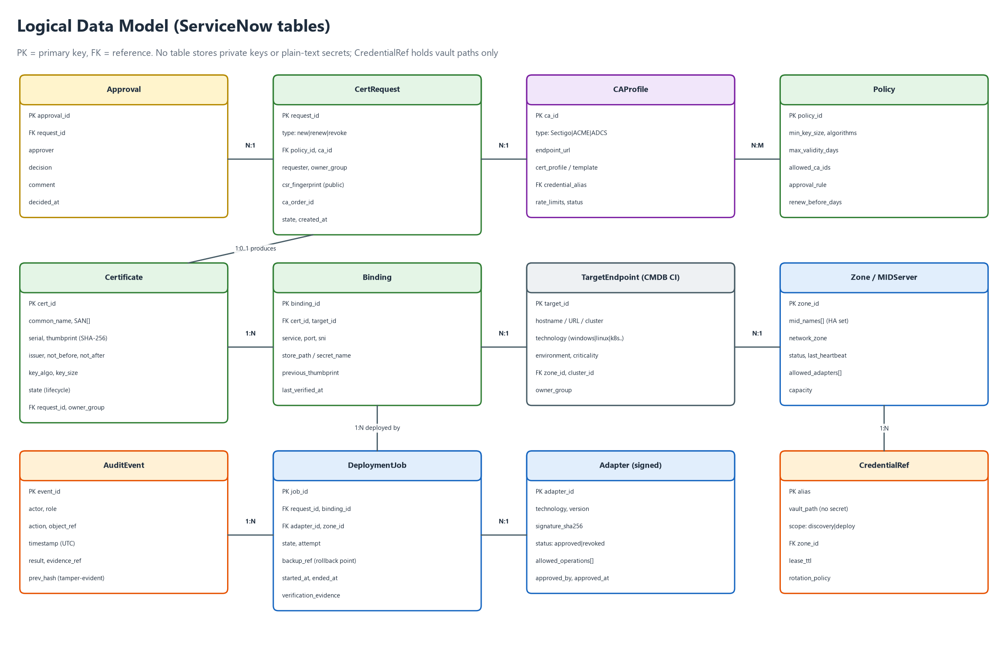

*Figure 10: Logical data model*

| State | Meaning | Exit conditions |
|---|---|---|
| Discovered | Found by discovery or import, not yet managed. | Adopt into a request, or mark unmanaged. |
| Requested | Request submitted and being validated against policy. | Policy ok, or rejected. |
| Pending approval | Waiting for approver or change. | Approved or rejected. |
| Approved | Cleared to go to the CA. | CSR submitted. |
| Issuing | At the CA (validation, processing). | Issued, failed or timed out. |
| Issued | Certificate and chain retrieved and validated. | Deploy job created. |
| Deploying | Adapter job running. | Installed, or rollback. |
| Verifying | Live endpoint verification. | Verified, or rollback. |
| Active | Deployed and verified. | Expiry window, revocation. |
| Expiring | In the renewal window. | Renewing, or expired. |
| Renewing | New request created automatically. | Issuing. |
| Rolled back | Deployment failed and was reverted. | Incident, retry after fix. |
| Expired / Revoked / Retired | End of life. | None (terminal). |

## 9. External interfaces

| Interface | Direction | Protocol and auth | Notes |
|---|---|---|---|
| ServiceNow to MID Server | Instance to MID | ECC queue; MID connects outbound over HTTPS 443 | Job payload signed; MID verifies adapter hash (FR-ADP-002). |
| MID Server to vault | MID to vault | HTTPS with mutual TLS; short-lived token | JIT secrets, dynamic SSH certificates, database or API tokens. |
| CDM to Sectigo | Instance or MID to CA | HTTPS REST; credentials from the vault | Enroll, collect, renew, revoke, list (Appendix C). Sandbox and production are separate profiles. |
| CDM to ACME CAs | Instance or MID to CA | HTTPS, ACME RFC 8555 | HTTP-01 or DNS-01 challenge. |
| MID to Windows target | MID to target | WinRM over HTTPS or Kerberos | JEA constrained endpoint preferred. |
| MID to Linux target | MID to target | SSH with signed certificates | Restricted sudo commands. |
| MID to Kubernetes | MID to API server | HTTPS with ServiceAccount token | Namespaced RBAC. |
| CDM to MDM | Instance or MID to MDM | HTTPS REST with API client | Profile assignment and inventory. |
| MID to load balancer | MID to device | HTTPS REST (iControl, NITRO) | Token from the vault. |
| CDM to SIEM | Instance to SIEM | Syslog over TLS or HTTPS | Audit stream. |
| CDM to ITSM | Inside ServiceNow | Native | Change, incident, task. |
| Users to CDM | Browser | HTTPS; SSO with MFA | Catalog, workspace, dashboards. |

## 10. Security and threat model

The security design follows Figure 4. The main threats and their mitigations:

| # | Threat | Mitigation | Requirements |
|---|---|---|---|
| T1 | Stolen credentials from a MID Server or script | Vault JIT secrets, per-zone accounts, 15-minute TTL, no secrets in scripts or variables | NFR-SEC-04, FR-CA-003 |
| T2 | Modified or malicious adapter script | Signed, allow-listed, version-controlled adapters; four-eyes approval | FR-ADP-002 to 005, NFR-SEC-03 |
| T3 | Private key exposure in transit, logs or storage | Key generated on target; no key in payloads; log redaction; encrypted short-lived temp storage where unavoidable | FR-KEY-001 to 003, NFR-SEC-05 |
| T4 | Unauthorised or wrongful certificate issuance | Policy checks, approvals, domain allow-lists, CA-side validation, segregation of duties | FR-REQ-002, 003, FR-ADM-001 |
| T5 | Compromised MID Server used to pivot | Outbound-only, zone segmentation, egress allow-list, hardening, minimal privilege | NFR-SEC-02, FR-ORC-004 |
| T6 | Wrong certificate deployed or service broken | Name check, pre-check, backup, live verification, automatic rollback | FR-SAF-001 to 005, 010 |
| T7 | Job payload tampering or replay | Signed job payloads; MID validates signature and adapter hash; nonce and expiry | FR-ADP-002, NFR-SEC-03 |
| T8 | Insider misuse | Segregation of duties, tamper-evident audit, time-boxed break-glass | FR-ADM-001, FR-RPT-002 |
| T9 | CA or API outage | Retry, back-off, 30-day renewal buffer, second CA option | FR-CA-007, NFR-AVL-03 |
| T10 | Mass renewal overload (for example after a CA incident) | Throttling, concurrency limits, staged rollout | FR-CA-009, FR-ORC-006, 009 |
| T11 | Supply-chain compromise of adapter dependencies | Pinned and scanned dependencies, signed builds | FR-ADP-005 |

## 11. From POC to production

### 11.1 What the POC must still prove

The POC remains useful as a low-cost proof of the flow. To make it prove the right things, adjust it as follows before or during Phase 1.

| POC change | Closes | Requirement |
|---|---|---|
| Replace mock_sectigo.ps1 with a test CA that accepts a CSR and returns a real signed PEM (correct newlines, content type, chain). | G1, G6 | FR-CA-010 |
| Generate the key and CSR on the Windows target with certreq, install with certreq -accept, and prove the private key is associated. | G2 | AD-WIN-04, AD-WIN-05 |
| Move WinRM to HTTPS (self-signed for the POC) and remove Basic and AllowUnencrypted. | G3 | AD-WIN-02 |
| Replace the single admin password with a vault alias (a local vault container is enough) and split discovery from deployment accounts. | G4 | FR-INV-006, NFR-SEC-04 |
| Replace pasted script text with a registered adapter that takes parameters. | G5 | FR-ADP-002 to 004 |
| Add a CMDB target record and derive technology from it. | G7 | FR-ORC-003 |
| Upgrade the Linux simulator and add a real Linux target. | G8 | AD-LNX-12 |
| Add pre-check, backup, verify and rollback to both branches. | G8 | FR-SAF-001 to 004 |

### 11.2 POC exit criteria

- A CSR generated on the Windows target is signed by the test CA, imported, bound to the key, and verified over TLS on the live port.
- The same flow deploys a certificate to a real Linux target with correct permissions and a service reload.
- A forced failure (wrong SAN, service that will not reload) triggers automatic rollback and is verified.
- No password or private key appears in any script, flow variable, log or ECC payload.
- The technology and zone come from the CMDB record; changing the record changes the route without editing the flow.

### 11.3 Roadmap

Figure 11 shows the phases. Durations are indicative and depend on the answers in chapter 14.

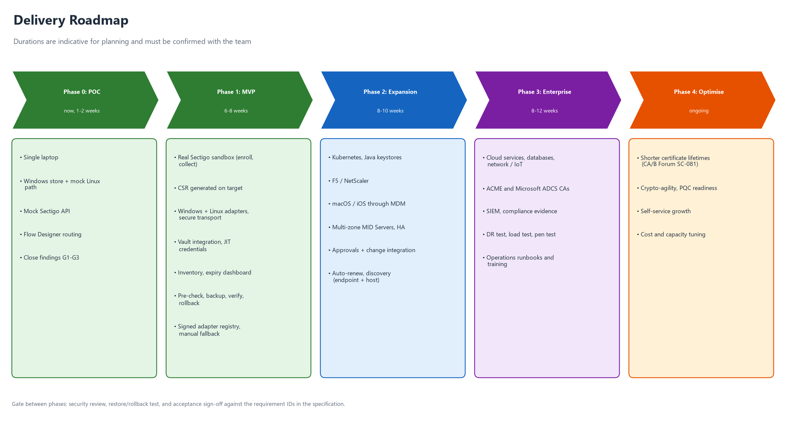

*Figure 11: Delivery roadmap*

## 12. Test and acceptance strategy

| Level | What is tested | Tools and approach |
|---|---|---|
| Unit | Adapter functions, parsing, validation, policy engine. | Pester for PowerShell, shell test frameworks for Linux, script tests in ServiceNow. |
| Integration | CA connector against the test CA and the Sectigo sandbox; vault; MID Server. | Automated pipeline with the test CA. |
| End to end | Request to verified deployment on each platform, including failure paths. | Lab targets per platform: Windows, Linux, Kubernetes (kind or minikube), MDM test tenant, F5 virtual edition. |
| Failure injection | Bad certificate, wrong SAN, service will not reload, MID failure mid-job, CA timeout. | Scripted faults; expect rollback or manual fallback. |
| Security | Secret and key leakage, log redaction, adapter tampering, privilege boundaries, network exposure. | Secret scanning, tamper tests, penetration test before Phase 1 go-live. |
| Performance and resilience | Volume, concurrency, MID failover, disaster recovery. | Load and chaos tests. |
| User acceptance | Requester, approver, operator and auditor journeys. | Scripted UAT with sign-off. |

### 12.1 Representative acceptance tests

| ID | Scenario | Expected result |
|---|---|---|
| TC-01 | New certificate for a Windows IIS site | Key generated on host, CSR signed, bound, thumbprint verified on port 443, audit complete. |
| TC-02 | Renewal of a Linux nginx certificate 30 days before expiry | Runs unattended; permissions correct; reload hitless; old certificate backed up. |
| TC-03 | SAN mismatch on deployment | Refused before change (FR-SAF-010); no service impact. |
| TC-04 | Service fails to reload after install | Automatic rollback, verified, incident created. |
| TC-05 | Kubernetes ingress secret update with a failing pod | Rollout stops; previous Secret restored; verified. |
| TC-06 | F5 HA pair deployment | New object created, profile updated, sync confirmed, both units verified. |
| TC-07 | iPhone identity certificate through MDM | Profile assigned; MDM shows installed; offline device shows pending, not failed. |
| TC-08 | Technology without an adapter | Manual task with instructions; completion triggers automated verification. |
| TC-09 | MID Server killed mid-deployment | Job resumes on the peer or rolls back within 5 minutes. |
| TC-10 | Unsigned or modified adapter | Execution blocked and alert raised. |
| TC-11 | Secret scan of logs, ECC payloads and flow context after a full run | No keys, passwords or PKCS#12 content found. |
| TC-12 | Requester approves own request | Denied by segregation of duties. |

### 12.2 Phase acceptance

| Phase | Accepted when |
|---|---|
| P0 POC | The POC exit criteria in chapter 11 are met. |
| P1 MVP | Windows, Linux and manual paths pass TC-01 to TC-04, TC-08, TC-10 to TC-12 against the real Sectigo sandbox; security review and penetration test are closed. |
| P2 Expansion | Kubernetes, Java, F5 and Apple paths pass TC-05 to TC-07; multi-zone HA passes TC-09; discovery is running. |
| P3 Enterprise | Cloud, database and network adapters delivered; disaster recovery and load tests pass; SIEM and compliance reports in use. |

## 13. Risks and dependencies

| # | Risk or dependency | Impact | Mitigation |
|---|---|---|---|
| R1 | The ServiceNow PDI has limits: it can be reclaimed after inactivity and may not include Integration Hub or Orchestration steps such as the PowerShell action assumed in the plan. | POC blocked or non-representative | Confirm plugins now (Q1); keep a scripted-REST and MID script-include fallback; back up update sets. |
| R2 | No Sectigo sandbox or API access yet. | Phase 1 delayed | Use the test CA meanwhile; request the sandbox now (Q2). |
| R3 | Vault product undecided. | Blocks secure credentials | Start with a local Vault container; keep the interface vendor-neutral (Q3). |
| R4 | A Windows laptop MID Server and loopback targets are unrepresentative of production. | False confidence | Add real Linux and a second host early in Phase 1. |
| R5 | Scope creep from the all-technologies requirement. | Late delivery | Strict phasing (FR-ADP-006); manual fallback covers the long tail. |
| R6 | Apple devices are offline or unsupervised. | Slow or partial rollout | Pending state with SLA; supervised devices for silent install. |
| R7 | Certificate lifetimes keep shrinking. | Higher renewal volume | Design for daily scheduling and throttling (NFR-CRY-01). |
| R8 | Adapter maintenance burden as platforms change. | Technical debt | Contract versioning, tests, ownership per adapter. |
| R9 | Firewall and network approvals for MID Servers per zone. | Delays | Raise requests early; use outbound-only design to simplify approval. |
| R10 | Skills across ServiceNow, PKI, Windows, Linux, Kubernetes and MDM. | Quality risk | Pair engineers with platform owners; review gates. |

## 14. Decisions and open questions

These are the points where your answer changes the design. Each has a default that will be used if you do not decide otherwise.

| # | Question | Default if not answered |
|---|---|---|
| Q1 | Is ServiceNow the production orchestrator? Which licences and plugins are available (Discovery, Integration Hub, Orchestration, the PowerShell step)? Should the ServiceNow certificate-management offering be evaluated as build versus buy? | Build a scoped ServiceNow application. |
| Q2 | Which Sectigo product and tenant do you have (Sectigo Certificate Manager)? Is a sandbox available, and is ACME enabled? Which domain-validation method is used? Any second CA? | Sectigo first, ACME as second connector. |
| Q3 | Which vault: HashiCorp Vault, CyberArk, Azure Key Vault, or the ServiceNow credential store with an external vault? | HashiCorp Vault behind a neutral interface. |
| Q4 | "iOS": does it mean Apple devices (iOS, iPadOS, macOS) or Cisco IOS network devices? | Apple devices via MDM in Phase 2; Cisco IOS in Phase 3. |
| Q5 | Which MDM (Intune, Jamf, Workspace ONE)? | Intune and Jamf. |
| Q6 | How many targets by type (Windows, Linux, Kubernetes clusters, F5, Java, Apple devices)? This sets the phase order. | Order as in the roadmap. |
| Q7 | Are exceptions to target-side key generation acceptable (for example appliances that require a PKCS#12)? | Yes, only under FR-KEY-003. |
| Q8 | How many network zones, where do MID Servers sit, and what is the lead time for firewall changes? | Three zones: DMZ, internal, cloud. |
| Q9 | Should approvals and change use ServiceNow Change, or another tool? | ServiceNow Change. |
| Q10 | Which compliance regimes apply (PCI DSS, ISO 27001, SOC 2, HIPAA, others)? | ISO 27001 and SOC 2 mapping. |
| Q11 | Default renewal window and maximum validity policy? | Renew 30 days before expiry; maximum validity set by CA/B Forum rules. |
| Q12 | What defines POC success, by when, and who is the audience for the demo? | POC exit criteria in chapter 11. |
| Q13 | The screenshots are cut off: data1.jpeg ends mid-sentence and data3.jpeg stops at item 9. Can you share the remaining text? | Assume the manual-task interpretation and no further principles. |
| Q14 | Will production MID Servers run on Windows or Linux? | Linux for zones that host Linux targets, Windows where WinRM is needed. |
| Q15 | Should CDM also cover S/MIME, code-signing and SSH certificates? | No; out of scope for now. |

## Appendix A: Adapter contract (draft)

Every adapter implements the same operations and returns the same envelope. Inputs are typed parameters, never script text.

```json
Request (from orchestrator, signed):
{
  "job_id": "JOB0012345",
  "operation": "install",            // precheck | backup | generate_csr | install | activate | verify | rollback | cleanup | discover
  "adapter": {"id": "win-iis", "version": "1.3.0", "sha256": "<hash>"},
  "target": {"id": "CI0009876", "host": "app01.example.com", "zone": "internal", "technology": "windows"},
  "binding": {"service": "iis", "port": 443, "sni": "app.example.com", "store": "LocalMachine\\My"},
  "certificate": {"pem_chain": "<public certificate and chain only>", "thumbprint": "<sha256>"},
  "credential_alias": "cdm/internal/windows/deploy",   // resolved just in time by the MID Server
  "timeout_seconds": 300
}

Response (from adapter):
{
  "job_id": "JOB0012345",
  "status": "success",               // success | failed | rolled_back | manual_required
  "error_code": null,                // from the error catalogue (FR-ADP-009)
  "evidence": {"thumbprint_before": "...", "thumbprint_after": "...", "presented_san": ["app.example.com"], "not_after": "2027-03-19T00:00:00Z"},
  "cleanup": {"temp_files_removed": true, "session_closed": true}
}
```

## Appendix B: Example policy (draft)

```json
{
  "policy_id": "POL-PROD-WEB",
  "min_key": {"rsa": 3072, "ecdsa": ["P-256", "P-384"]},
  "max_validity_days": 200,
  "allowed_ca": ["sectigo-prod"],
  "allowed_domains": ["*.example.com"],
  "wildcard": {"allowed": false, "approval": "pki_admin"},
  "approval": {"production": "change_manager", "non_production": "auto"},
  "renew_before_days": 30,
  "deploy_window": "CHG-window",
  "require_verification": true,
  "rollback_on_failure": true
}
```

## Appendix C: Sectigo Certificate Manager API (indicative)

The connector is built on the Sectigo Certificate Manager REST API. The list below is indicative and must be verified against the current Sectigo documentation and your tenant before implementation (Q2).

| Operation | Indicative endpoint | Notes |
|---|---|---|
| Authentication | Headers: login, password (or API key), customerUri | Stored as vault aliases only (FR-CA-003). |
| Enroll | POST /api/ssl/v1/enroll | Body carries CSR, certificate type or profile ID, term, external requester, SAN list. |
| Collect | GET /api/ssl/v1/collect/{sslId}?format=... | Format selects PEM with chain or other encodings; issuance can be asynchronous. |
| Renew | POST /api/ssl/v1/renewById/{sslId} | A new CSR is preferred (FR-KEY-006). |
| Revoke | POST /api/ssl/v1/revoke/{sslId} | Reason code required. |
| List and status | GET /api/ssl/v1 (filters) | Used for reconciliation (FR-INV-007). |

## Appendix D: Source traceability

Every source in the POC folder maps to requirements as follows.

| Source | Main requirements it drives |
|---|---|
| Promp.md.txt (PLAN) | FR-CA-002, FR-ORC-002, FR-ORC-003, FR-ADP-006, AD-WIN-11, chapter 11 |
| POC_SETUP_STATUS.md (SETUP) | FR-CA-004, NFR-SEC-01, AD-WIN-02, findings G3 and G4 |
| mock_sectigo.ps1 (MOCK) | FR-CA-010, finding G1 |
| data1.jpeg (D1) | FR-INV-004 to 006, FR-ADP-001, FR-ADP-006, FR-NTF-003, FR-NTF-004, NFR-PRT-01 |
| data2.jpeg (D2) | FR-KEY-001 to 003, FR-CA-003, FR-ORC-004, FR-SAF-008, NFR-SEC-01 to 05, NFR-AVL-01, NFR-AVL-02, FR-ADM-006 |
| data3.jpeg (D3) | FR-ADP-002 to 005, FR-SAF-001 to 007, FR-ORC-009, FR-ADM-005, NFR-SEC-03 |
